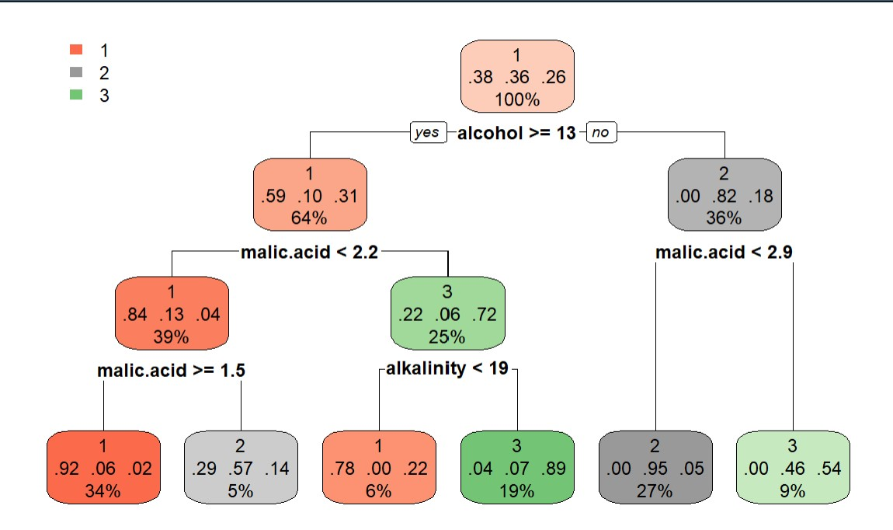

# Data Mining
CS634 project directory

`Target`: 
- Time Series and Graph Mining Application

`Requirements`:
- R and RStudio to create a comprehensive time series and graph mining application.
- Highlight association, dependency analysis, and advanced data mining techniques.

`Components`:

- *cpu_tests*: This directory includes the set of computations used to benchmark and test the efficiency of the data mining algorithms implemented.

- *database*: Houses the primary datasets used for time series and graph mining, demonstrating practical use of real-world data in mining operations.

- *docs*: Contains documentation related to the project, elaborating on the design choices, methodologies, and results of the implemented data mining techniques.

- *img*: Includes images and diagrams visualizing the outcomes of the data mining process, helping to understand and interpret the results.

- *utilities*: Comprises helper scripts and additional tools that facilitate the mining and data analysis processes.

- *duggan_william_final_project_code.R*: The main R script file containing the source code for the data mining application.

---

